# 💄 Saya Beauty Parlor ✨

A complete, modern, and responsive **Beauty Parlor Management System** that lets customers browse services, book appointments online, and allows managers to handle everything — appointments, staff, billing, and revenue — from a sleek admin dashboard. Built with Flask, SQLite, Bootstrap 5, and Chart.js.

<div align="center">

[](https://www.python.org/)
[](https://flask.palletsprojects.com/)
[](https://developer.mozilla.org/en-US/docs/Web/HTML)
[](https://developer.mozilla.org/en-US/docs/Web/CSS)
[](https://getbootstrap.com/)
[](https://developer.mozilla.org/en-US/docs/Web/JavaScript)

[](https://www.sqlite.org/)
[](https://www.chartjs.org/)
[](https://werkzeug.palletsprojects.com/)
[](https://jinja.palletsprojects.com/)
[](https://fontawesome.com/)
[](#)

[Features](#-key-features) • [Installation](#-installation--setup) • [Usage](#-usage-guide) • [Routes](#-route-reference) • [Database](#-database-design) • [Screenshots](#-project-screenshots)

</div>

---

## 🌟 Overview

**Saya Beauty Parlor Management System** is a full-stack web application that combines a beautiful public-facing landing website with a powerful backend admin dashboard. Customers can explore services, packages, staff, gallery, and book appointments — while the manager gets a complete toolkit to manage the entire business from one place.

---

### 🎯 Mission

To digitize and simplify the daily operations of beauty parlors — from customer appointments to staff management and revenue tracking — all in one elegant, easy-to-use platform.

### 🏆 Why Saya Beauty Parlor System?

- ✅ **Beautiful Landing Website** — Attracts customers with a premium, feminine design
- ✅ **Online Appointment Booking** — Customers can book 24/7 without calling
- ✅ **Secure Admin Dashboard** — Full business control for the manager
- ✅ **Automated Customer Records** — Customers are saved automatically on booking
- ✅ **Smart Billing System** — Generate, print, and download professional invoices
- ✅ **Revenue Reports with Charts** — Visualize business performance at a glance
- ✅ **Mobile Responsive** — Works perfectly on phones, tablets, and desktops
- ✅ **Production Ready** — Clean, secure, and client-deployable code

---
## 📸 Project Screenshots

Here are some screenshots of the **Saya Beauty Parlor Website & Manager Dashboard**.

---

### 🌐 Landing Website Pages

| Section | Preview |
|---|---|
| **Home Section** | 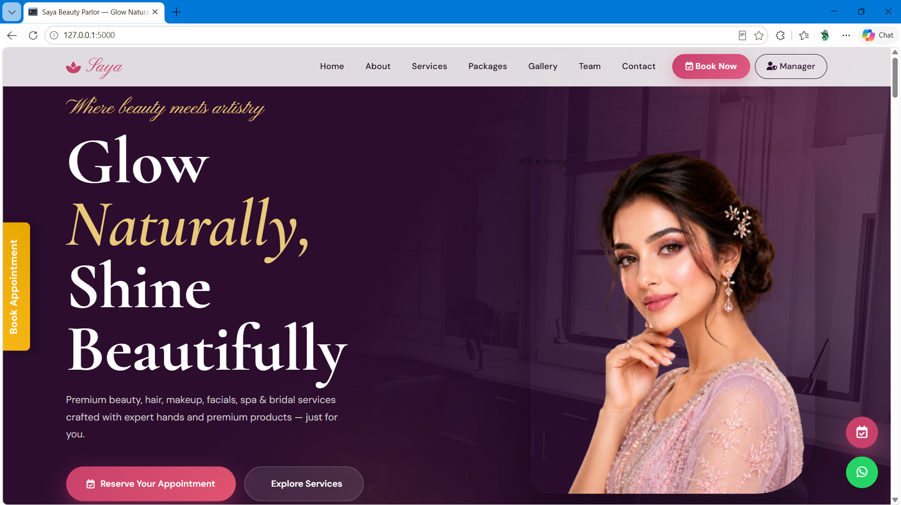 |
| **About Section** | 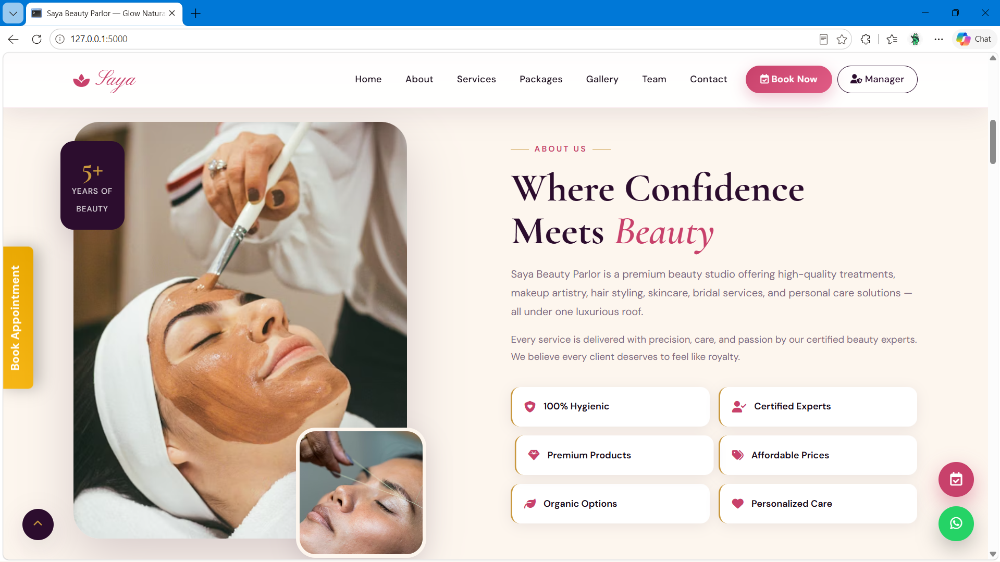 |
| **Services Section** | 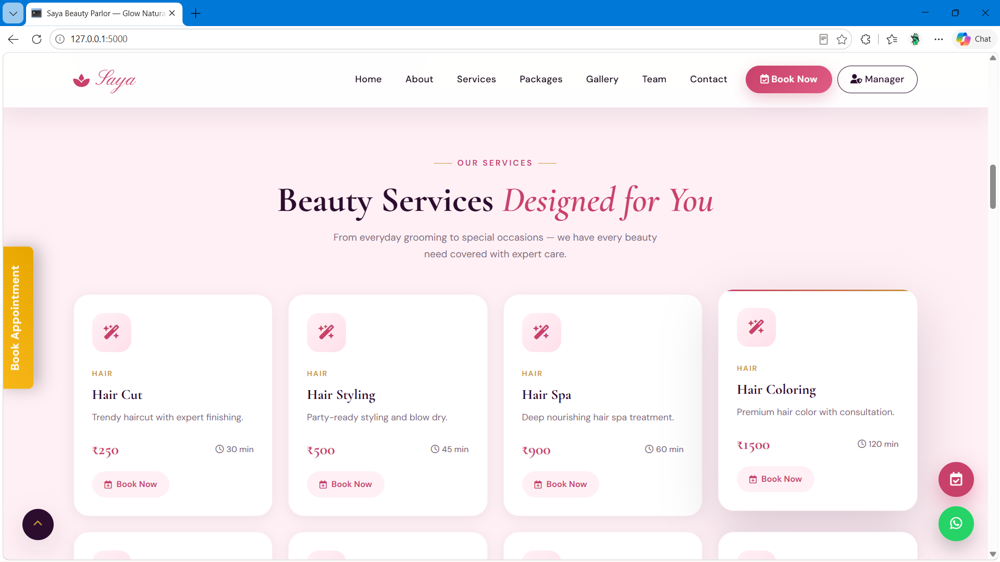 |
| **Package Section** | 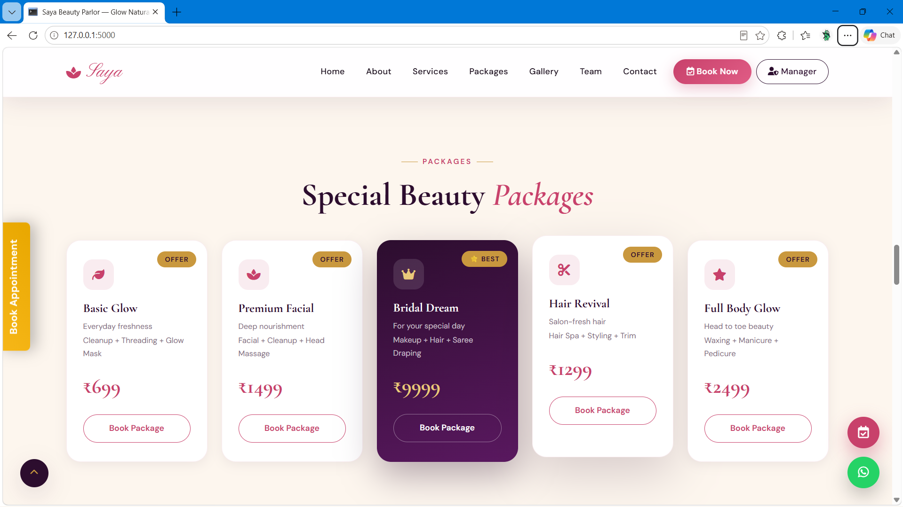 |
| **Moments Section** | 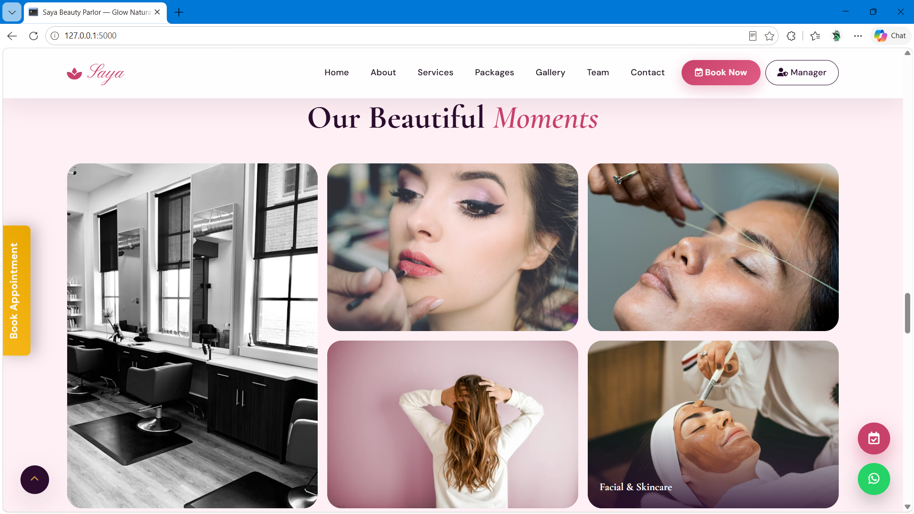 |
| **Our Team Section** | 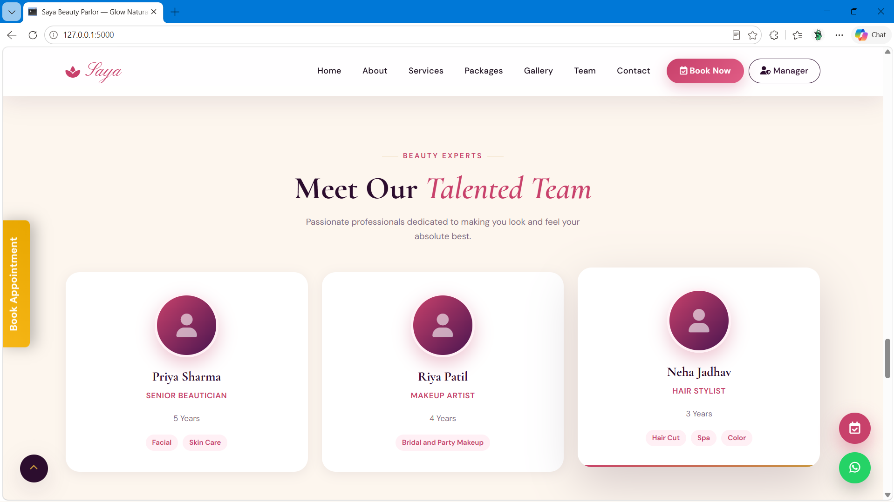 |
| **Client Review Section** | 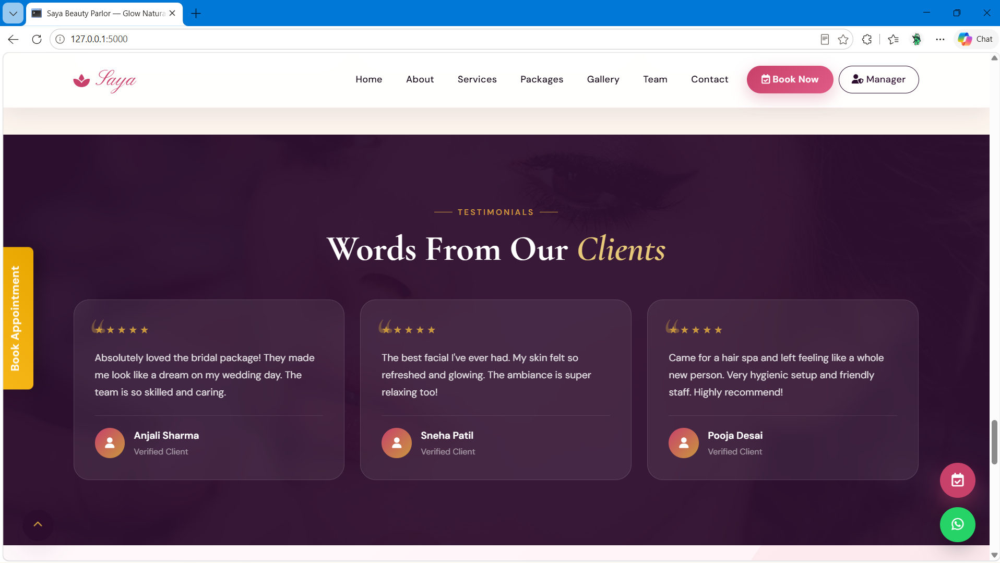 |
| **Book Appointment Section** | 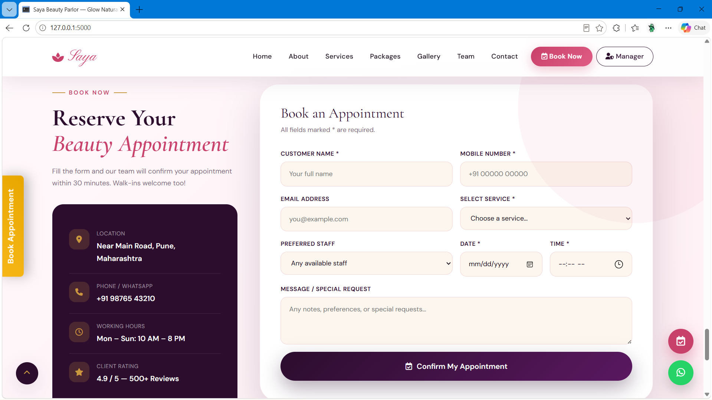 |
| **Contact Section** | 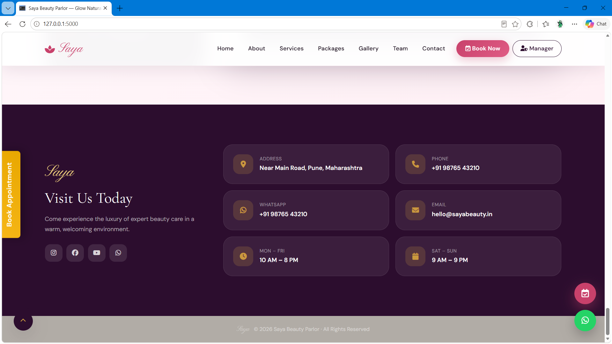 |

---

### 🔐 Manager & Admin Dashboard Pages

| Page | Preview |
|---|---|
| **Login Page** | 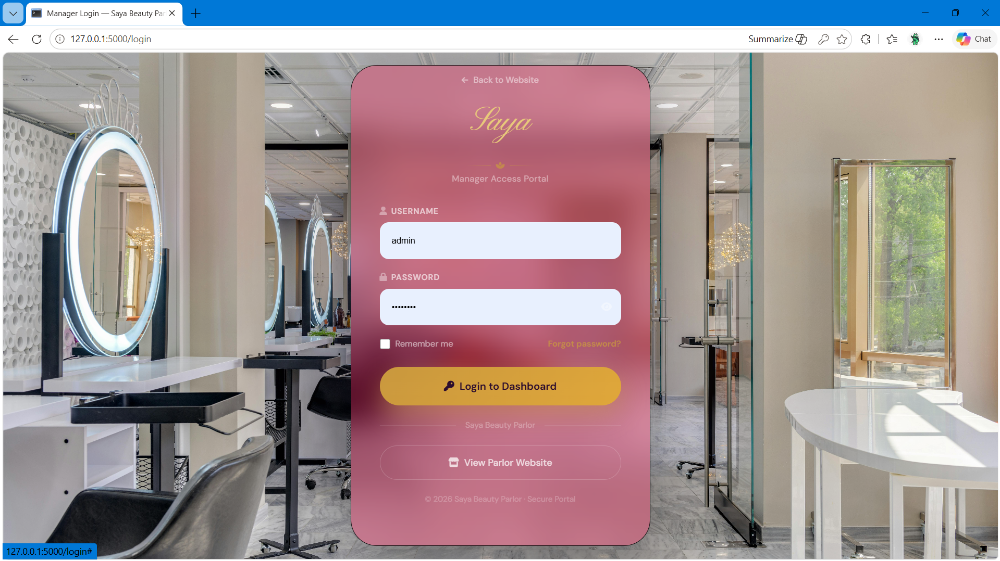 |
| **Dashboard Page** | 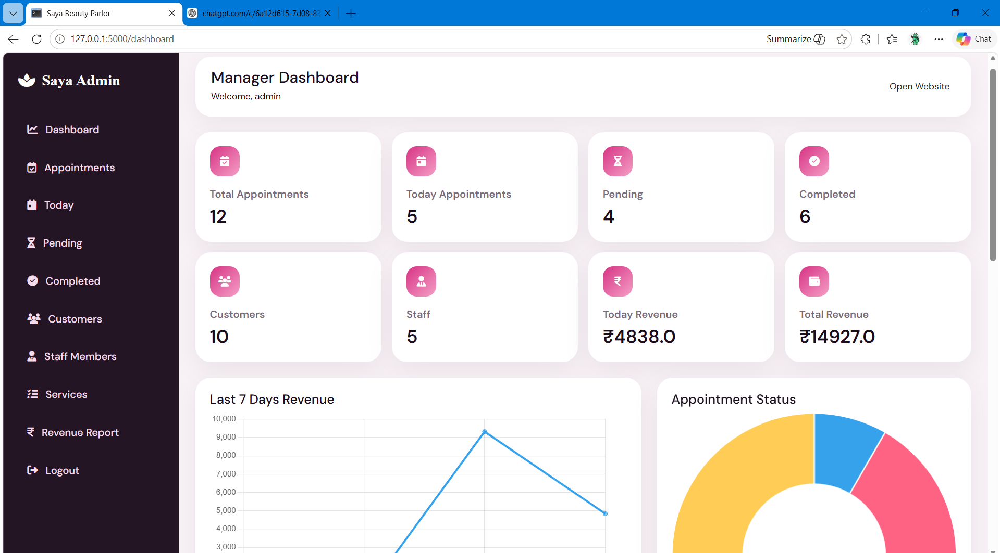 |
| **All Appointment Page** |  |
| **Today Appointment Page** | 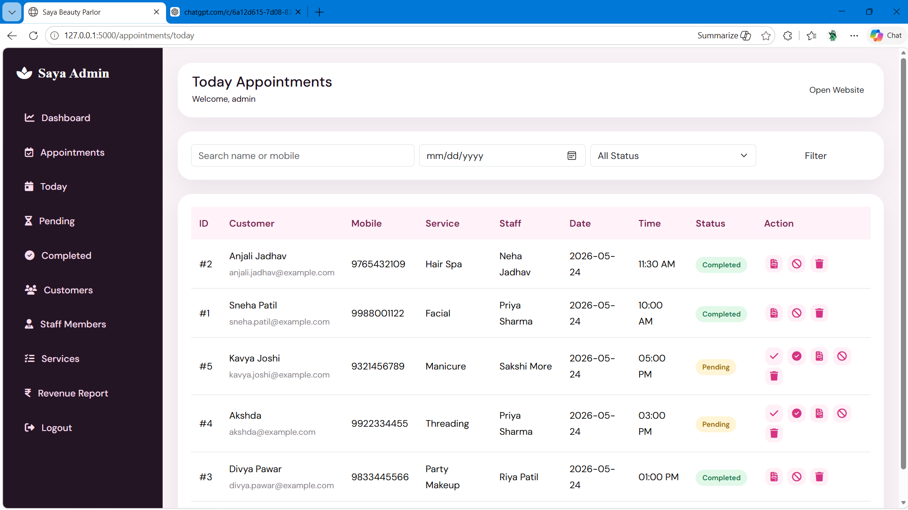 |
| **Staff Member Page** | 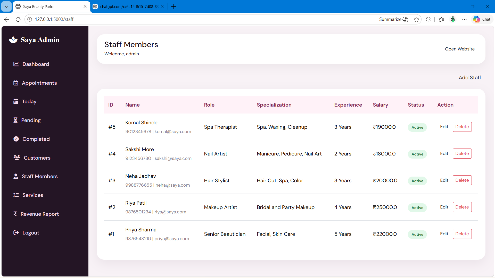 |
| **Services Page** | 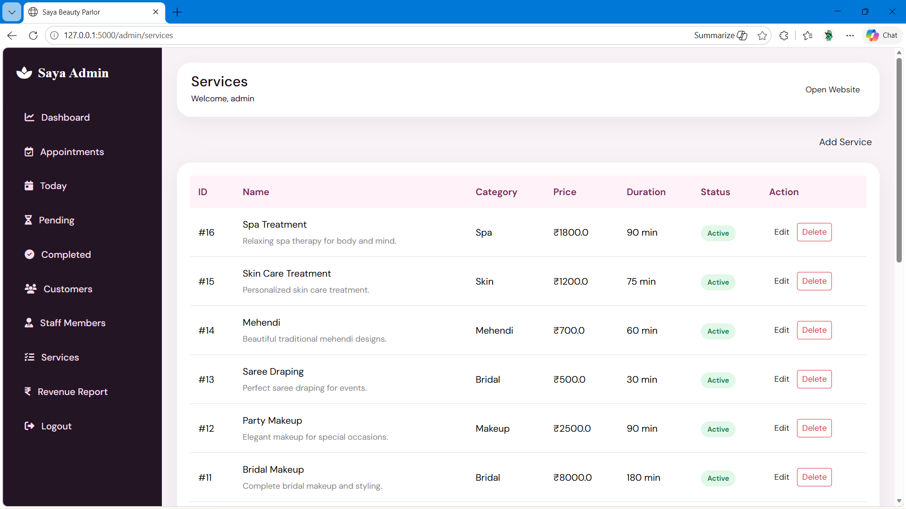 |
| **Revenue Page** | 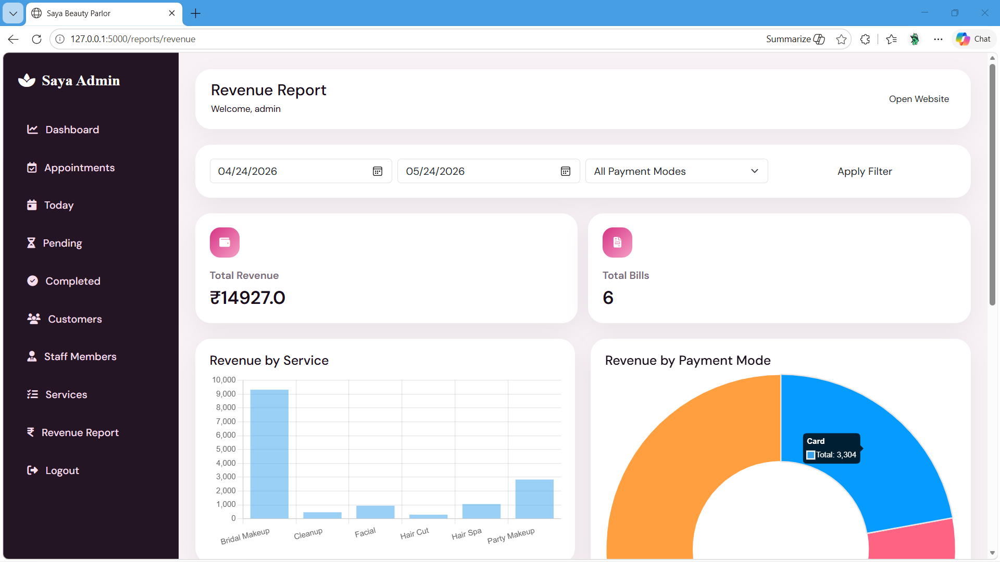 |
| **Loading Splash Page** | 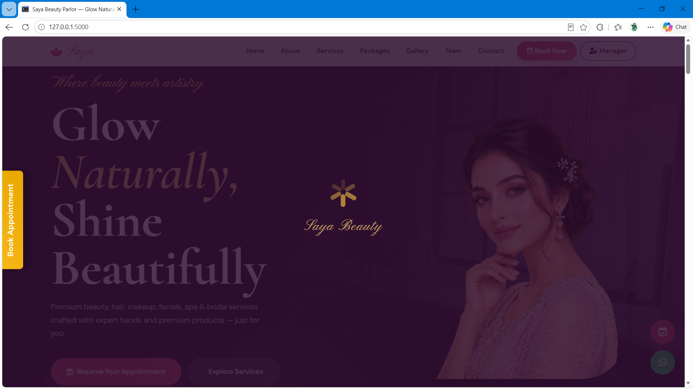 |

## ✨ Key Features

### 🌐 Public Landing Website

| Section | Highlights |
|---------|-----------|
| **Navbar** | Logo, navigation links, Book Appointment CTA button |
| **Hero** | Full-screen background, "Glow Naturally, Shine Beautifully" tagline |
| **About** | Parlor story, values, and quality promise |
| **Services** | 16 services with icon, price, duration & Book Now button |
| **Packages** | 5 curated beauty packages with offer badges |
| **Gallery** | Salon interior, bridal looks, hair styling, transformations |
| **Staff** | Team cards with role, experience & specialization |
| **Testimonials** | Customer reviews with star ratings |
| **Why Choose Us** | Hygienic, affordable, expert staff highlights |
| **Contact** | Address, phone, WhatsApp, email, hours & map |
| **Booking Form** | Full appointment form saved to database |

### 🔐 Authentication

- Secure manager login at `/login`
- Flask session-based authentication
- Werkzeug password hashing (`pbkdf2:sha256`)
- All admin routes protected with login guard
- Logout with session clear

### 🗓️ Appointment Management

| Action | Description |
|--------|-------------|
| View All | Full appointment table with search & filter |
| Today | Only current date appointments |
| Pending | Awaiting confirmation |
| Confirmed | Manager-approved appointments |
| Completed | Service delivered — bill ready |
| Cancelled | Cancelled by manager |
| Generate Bill | Triggered after marking Complete |
| Delete | Remove appointment from records |

### 👥 Customer Management

- Auto-saved from every booking form submission
- Track total visits, total spend, and last visit date
- Search by name or mobile number
- View complete visit history per customer

### 👩‍💼 Staff Management

- Add / Edit / Delete staff members
- Track role, specialization, experience, salary, joining date
- Active / Inactive status toggle
- View staff assigned to appointments

### 💅 Service Management

- Add / Edit / Delete services
- Categories: Hair · Skin · Makeup · Bridal · Spa · Nails · Mehendi
- Set price, duration, and availability status

### 🧾 Billing System

- Professional invoice generation after appointment completion
- Supports: Extra charges, Discount, GST
- Payment modes: Cash · UPI · Card · Online
- Clean printable invoice with parlor branding
- Mark bills as Paid / Unpaid

### 📊 Revenue Reports

- Today / Weekly / Monthly / Total revenue
- Revenue by service and payment mode
- Date range filter
- Chart.js powered visualizations:
  - Daily revenue bar chart
  - Monthly trend line chart
  - Service-wise revenue pie chart

---

## 🚀 Installation & Setup

### Prerequisites
- Python 3.8+
- pip

### Step-by-Step Installation

```bash
# 1. Clone the repository
git clone https://github.com/yourusername/saya-beauty-parlor.git
cd saya-beauty-parlor

# 2. Create a virtual environment
python -m venv venv

# Activate on Windows
venv\Scripts\activate

# Activate on macOS / Linux
source venv/bin/activate

# 3. Install all dependencies
pip install -r requirements.txt

# 4. Initialize the database
python database.py

# 5. Run the Flask application
python app.py
```

Open **http://127.0.0.1:5000** in your browser — you're live! 🎉

> The SQLite database is created automatically at `database/saya_parlor.db` on first run.

### Dependencies

```
Flask==2.3.3
Werkzeug==2.3.7
```

---

## 🔑 Default Admin Credentials

```
URL      : http://127.0.0.1:5000/login
Username : admin
Password : admin123
```

> ⚠️ Please change the default password after your first login.

---

## 📁 Project Structure

```
saya-beauty-parlor/
│
├── app.py                        # Flask app — all routes and logic
├── database.py                   # Database setup and seed data
├── requirements.txt
├── README.md
│
├── static/
│   ├── css/
│   │   ├── style.css             # Landing page styles
│   │   └── dashboard.css         # Admin dashboard styles
│   ├── js/
│   │   ├── main.js               # Landing page scripts
│   │   └── dashboard.js          # Dashboard charts & interactions
│   └── images/
│       ├── hero.jpg
│       ├── about.jpg
│       ├── gallery1.jpg
│       ├── gallery2.jpg
│       └── logo.png
│
├── templates/
│   ├── base.html                 # Shared public layout
│   ├── index.html                # Landing page
│   ├── login.html                # Manager login
│   └── admin/
│       ├── dashboard.html        # Dashboard home with stats & charts
│       ├── appointments.html     # All appointments table
│       ├── today_appointments.html
│       ├── customers.html        # Customer list & search
│       ├── staff.html            # Staff list
│       ├── add_staff.html
│       ├── edit_staff.html
│       ├── services.html         # Service list
│       ├── add_service.html
│       ├── edit_service.html
│       ├── generate_bill.html    # Bill creation form
│       ├── view_bill.html        # Printable invoice
│       └── revenue_report.html   # Charts & filters
│
└── database/
    └── saya_parlor.db            # SQLite database (auto-created)
```

## 🎨 Design Theme

| Element | Value |
|---------|-------|
| Primary Color | Pink / Rose Gold |
| Background | White / Soft Cream |
| Accent | Light Purple |
| Text | Soft Black |
| Style | Feminine · Elegant · Premium |
| Animations | Smooth hover & scroll effects |
| Responsive | ✅ Mobile, Tablet & Desktop |

---

## 🛡️ Security

- Passwords hashed with **Werkzeug** `pbkdf2:sha256`
- Session-based authentication — no token leaks
- All admin routes guarded by login check
- Parameterized SQLite queries — SQL injection safe
- File uploads validated for type and size
- Flash messages for all success and error events
- Empty form submission prevented (client + server validation)

---

## 🎊 Mission Accomplished

**Saya Beauty Parlor System is production-ready!**

✅ Complete public landing website  
✅ Online appointment booking  
✅ Secure manager authentication  
✅ Full appointment lifecycle management  
✅ Automated customer record keeping  
✅ Staff & service management  
✅ Professional billing & invoice system  
✅ Revenue reports with Chart.js  
✅ Mobile responsive design  
✅ Security implemented  
✅ Flash messages & form validation  
✅ Clean, reusable template structure  

**Total Modules**: 12  
**Quality**: Enterprise-grade  
**Status**: ✅ Client Ready  

---

## 📜 License

MIT License — free to use, modify, and distribute.

---

<div align="center">

## ✨ Thank You!

### Final Words

Thank you for choosing **Saya Beauty Parlor Management System**! We hope this platform helps your parlor grow, delight customers, and run smoothly every day.

> **"Because every customer deserves to feel beautiful — and every business deserves to run beautifully."**

### Built for Beauty Parlors, Salons & Grooming Studios 💅

### Let's Help Every Parlor Go Digital! 🚀

---

**⭐ Star us on GitHub!** • **🐛 Report Issues** • **💡 Request Features**

Made with Rushikesh Narawade and lots of chai ☕

© 2026 Saya Beauty Parlor. All rights reserved.

[Back to Top ↑](#-saya-beauty-parlor--management-system)

</div>